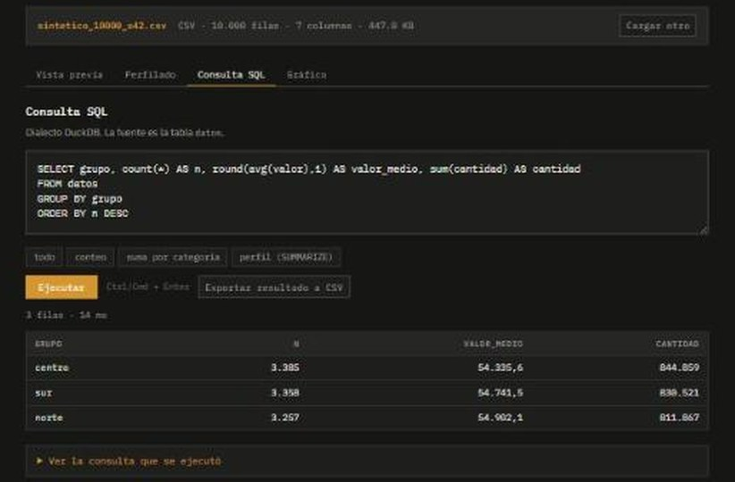

# consulta

> Motor OLAP embebido en el cliente para inspección exploratoria de datos tabulares:
> SQL sobre CSV y Parquet sin backend, sin ingesta y sin que el archivo abandone el
> navegador.



## Diseño

- **Ejecución local.** DuckDB-WASM sobre un Web Worker; el archivo se monta como
  buffer en el sistema de archivos virtual del runtime. Cero tráfico saliente, cero
  superficie de servidor.
- **Columnar y delimitado.** Ingesta nativa de Parquet (`read_parquet`) y de CSV con
  inferencia de esquema sobre el archivo completo (`read_csv_auto`, `SAMPLE_SIZE=-1`).
- **Perfilado enriquecido en una pasada.** Por columna: tipo, nulos, ceros,
  cardinalidad, cuantiles (p05 / mediana / p95), media y desviación — cada métrica
  con su definición al pasar el cursor — más un desglose de frecuencias de las
  columnas categóricas.
- **Editor SQL** en dialecto DuckDB contra la relación `datos`, con **plantillas**
  (exploración → tiempo → avanzado, 3 variaciones cada una) y proyección del
  resultado a CSV.
- **Combinar por pasos.** Un asistente arma cadenas de CTEs (`WITH … AS (…)`) a
  partir de subconsultas nombradas encadenadas; trae 3 ejemplos.
- **Gráfico.** Barras (agrupadas por serie), línea, multi-serie, área apilada y
  dispersión (coloreada por serie), en SVG sin librería de charting. Ejes y serie se
  derivan del tipo de gráfico y de las columnas del resultado; 3 presets arman
  consulta + gráfico de un tirón. **Zoom** arrastrando un tramo del eje X (doble clic
  o botón para volver), **etiquetas de datos** con toggle, leyenda por serie y
  **descarga a SVG** autónomo.
- **Utilidades.** Copiar los nombres de columna al portapapeles; pegar una línea de
  encabezados para armar un `SELECT`.
- **Glosario.** `glosario.html` define en lenguaje llano cada término (CSV, Parquet,
  CTE, cuantil, WASM…). Nada hace falta saberlo de antemano.
- **Sin tooling.** HTML + módulos ES + CSS. Única dependencia de runtime: el bundle
  WASM, resuelto desde CDN en el primer arranque y cacheado.

## Uso

```bash
python -m http.server 8000   # un origin HTTP: los módulos ES no cargan sobre file://
```

Carga un archivo o pulsa **Generar** para una relación sintética. En ambos casos la
fuente queda expuesta como la relación `datos`.

## Generador de relaciones sintéticas

Cuatro formas dominio-neutro, todas con dimensión temporal, tipos mixtos y nulos
inyectados. El PRNG es determinista: la semilla reproduce la relación exacta. Salida
en CSV o en Parquet (este último materializado por el propio DuckDB,
`COPY … FORMAT PARQUET`). No se versiona ningún dataset.

| forma | columnas | para |
|---|---|---|
| **serie agregada mensual** | `periodo, segmento, serie, valor, unidades` | forecast, presupuesto, medias móviles, participación |
| **panel diario multi-entidad** | `entidad, fecha, m1, m2, m3` | ventanas móviles, estacionalidad semanal, comparables |
| **registro de eventos** | `ts, entidad, evento, valor` | conteo por ventana, sesionización, embudos |
| **métrica con quiebres** | `fecha, valor, es_outlier, regimen` | detección de anomalías, cambio de régimen |

Consultas que corren tal cual contra la forma *serie agregada mensual*:

```sql
-- serie de tiempo mensual
SELECT date_trunc('month', periodo) AS mes, sum(valor) AS total
FROM datos GROUP BY mes ORDER BY mes;

-- media móvil de 3 periodos
WITH m AS (SELECT date_trunc('month', periodo) AS mes, sum(valor) AS total FROM datos GROUP BY mes)
SELECT mes, total,
       round(avg(total) OVER (ORDER BY mes ROWS BETWEEN 2 PRECEDING AND CURRENT ROW), 2) AS mm3
FROM m ORDER BY mes;

-- pivote por dimensión
PIVOT (SELECT date_trunc('month', periodo) AS mes, segmento, valor FROM datos)
ON segmento USING sum(valor) ORDER BY mes;
```

Despliegue estático (GitHub Pages), sin paso de build. Backlog en [`ROADMAP.md`](ROADMAP.md).

## Límite conocido

El runtime se descarga desde jsDelivr en el primer arranque (~11 MB, luego en caché).
Para operación aislada, los bundles de `@duckdb/duckdb-wasm` se auto-alojan en
`vendor/` y se apunta `getJsDelivrBundles()` a rutas locales — pendiente.

---

## English

In-client OLAP for exploratory inspection of tabular data: SQL over CSV and Parquet,
no backend, no ingestion, the file never leaves the browser. DuckDB-WASM on a Web
Worker; one-pass enriched profiling (quantiles, nulls, zeros, per-dimension
frequencies); DuckDB-dialect SQL editor with a template library; a CTE assistant that
composes `WITH` chains; SVG charts (bar, line, multi-series, stacked area, scatter)
with drag-to-zoom on the X axis, toggleable data labels, per-series legend and
standalone-SVG export; CSV export. A deterministic synthetic-relation generator with
four time-oriented shapes. No build step.
